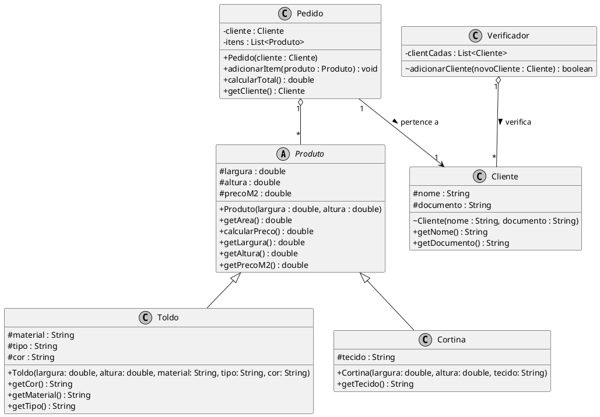
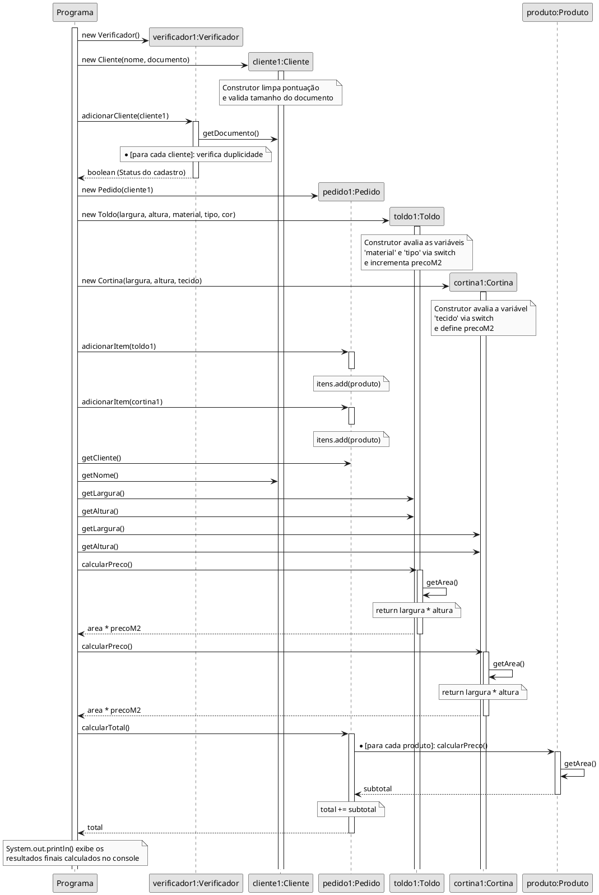

# g4
## Sistema de Gestão de Orçamento — Documento de Escopo e Planejamento

## Membros 
- Amanda - Amanda8709
- Dalila - lirbparente
- Daniel - Daniel-TeixeiraDS
- Isabela - Isamabuque
- Rafaella - rafaellamodanez

## Seção 1 - Introdução
### Justificativa
O processo de orçamento de produtos sob medida, como toldos e cortinas, historicamente se apoia em fluxos manuais. Isso recai diretamente a três gargalos operacionais: a lentidão no atendimento ao cliente, a alta suscetibilidade a erros humanos nos cálculos de metragens e componentes e a dispersão de dados comerciais cruciais. A centralização dessas operações em um ecossistema digital unificado é importante para padronizar o fluxo de trabalho, mitigar perdas financeiras decorrentes de orçamentos errôneos e fornecer uma base de dados íntegra para a tomada de decisões gerenciais.

### Descrição do Problema
O ambiente administrativo de lojas de decoração e coberturas sob medida sofre com a falta de rastreabilidade. Atualmente, o ciclo de vida de um orçamento é de difícil monitoramento, não há mecanismos práticos para extrair o histórico de vendas indexado por critérios como vendedor, cliente ou período temporal, o que impossibilita auditorias ágeis e análises de desempenho comercial individualizado. Ademais, o armazenamento de dados sensíveis de clientes sem critérios computacionais definidos expõe a organização a vulnerabilidades de conformidade legal. Por fim, as interfaces frequentemente negligenciam parâmetros de usabilidade e inclusão digital, criando barreiras de acessibilidade no cotidiano operacional.

### Motivação
A principal motivação deste projeto nasceu na oportunidade de criar uma solução de software de alta fidelidade técnica, utilizando **Java** no ecossistema e **JavaFX** para a construção de uma interface gráfica e responsiva para o usuário final. O grupo busca inovar através de uma arquitetura limpa, garantindo a perfeita harmonia entre a manipulação orientada a objetos no backend e os componentes visuais. O projeto se justifica academicamente pelo domínio prático das tecnologias propostas de engenharia de software e, também, pela democratização do acesso a ferramentas de gestão eficientes. 

## Seção 2 - Plano

### Objetivo Geral
Planejar, modelar e iniciar o desenvolvimento de um sistema desktop para automação e gerenciamento do ciclo de vida de orçamentos de toldos e cortinas, utilizando conceitos de Programação Orientada a Objetos com a linguagem **Java** e construção de interface via **JavaFX**, assegurando a conformidade técnica com parâmetros de usabilidade, acessibilidade e segurança de dados.

### Objetivos Específicos
**Estruturação de Arquitetura:** Mapear e implementar as entidades de domínio essenciais.

**Persistência e Operações CRUD:** Desenvolver a lógica modular para permitir operações completas de criação, leitura, atualização e deleção das entidades de cadastro, assim como validadores estruturais de documentos.

**Mecanismo de Precificação Automatizado:** Implementar uma classe de serviço matemática capaz de calcular dinamicamente a área e o preço final de produtos sob medida com base em variáveis bidimensionais (largura e altura) inseridas pelo usuário.

**Rastreabilidade e Estados:** Construir um motor de estados para controlar rigorosamente a transição do ciclo de vida dos orçamentos, prevenindo inconsistências de fluxo de caixa.

**Interface Responsiva com JavaFX:** Desenvolver um protótipo visual dinâmico que respeite as diretrizes da Lei Brasileira de Inclusão, oferecendo um ambiente administrativo fluido e livre de barreiras de uso.

**Segurança da Informação e LGPD:** Blindar o tráfego e armazenamento das strings de dados pessoais sensíveis dos clientes coletados no sistema.

## Seção 3 - Divisão de Tarefas

### Tarefas (Issues)
O projeto foi dividido em tarefas menores (Issues) dentro do GitHub para facilitar o desenvolvimento incremental e garantir o acompanhamento visual do progresso. Nesta Etapa 1, as principais tarefas mapeadas foram:
* **Configuração do Escopo:** Levantamento das justificativas, problemas e motivações do sistema de orçamento.
* **Modelagem UML Inicial:** Construção dos diagramas de classes e de sequência.
* **Implementação do Core:** Desenvolvimento das classes de domínio (`Produto`, `Toldo`, `Cortina`, `Pedido`, `Cliente` e `Verificador`) em Java.
* **Classe `Cliente`:** Responsável por encapsular dados do comprador, contendo atributos e métodos de validação estrutural baseados na LGPD.
* **Validação e Teste de Mesa:** Execução do fluxo através da classe `Programa` para garantir a precisão dos cálculos e ausência de bugs.

### Papéis e Responsabilidades
A equipe distribuiu as competências técnicas de acordo com os perfis de domínio para maximizar a eficiência no ecossistema Java/JavaFX:

* **Amanda da Silva Barros (Líder do Projeto):** Gestão do cronograma, refinamento do escopo com base nos requisitos e validação do projeto.
* **Rafaella Modanez (Arquiteto de Software):** Desenho da arquitetura estrutural do sistema, mapeamento dos diagramas UML e garantia de conformidade no código.
* **Dalila Rocha Parente (Desenvolvedora Backend):** Implementação do código, estruturação lógica dos construtores condicionais e desenvolvimento dos algoritmos matemáticos de precificação.
* **Isabela Martins Albuquerque (Desenvolvedora Frontend):** Planejamento dos protótipos visuais e preparação do ecossistema JavaFX.
* **Daniel Teixeira da Silva (Engenheiro de QA):** Escrita dos cenários de teste funcionais e validação dos fluxos principais.

## Seção 4 - Modelagem inicial

### Diagrama de Classes - V1

### Diagrama de Sequência - V1

### Descrição de Caso de Uso - V1

#### Caso de Uso 1 - Calcular Total do Pedido

| Campo | Descrição |
| :--- | :--- |
| **Nome** | calcularTotal |
| **Ator Principal** | Sistema |
| **Descrição** | O sistema percorre todos os produtos vinculados ao pedido para consolidar o valor final acumulado. |
| **Pré-condições** | O objeto `Pedido` deve conter as instâncias de produtos adicionadas à sua lista interna `itens`. |
| **Pós-condições** | O valor total acumulado do pedido é retornado. |
| **Fluxo Principal** | 1. O sistema invoca o método `calcularTotal()` da classe `Pedido`.  2. O sistema inicia um laço de repetição `for` para percorrer a lista `itens`.  3. Para cada objeto contido na lista, o método `calcularPreco()` é acionado.  4. O valor retornado de cada item é somado diretamente à variável acumuladora `total`.  5. O laço se encerra e o método retorna o valor contido em `total`. |
| **Alternativas** | 2a. Se a lista de itens estiver vazia, o laço de repetição não é executado e o método retorna o valor inicial zero (`0`). |

#### Caso de Uso 2 - Cadastrar Cliente com Validação

| Campo | Descrição |
| :--- | :--- |
| **Nome** | adicionarCliente |
| **Ator Principal** | Sistema |
| **Descrição** | O sistema recebe dados de um novo cliente, realiza a limpeza e validação do tamanho de seu documento corporativo ou pessoal e confere se este registro já se encontra duplicado. |
| **Pré-condições** | O objeto `Verificador` deve estar instanciado. |
| **Pós-condições** | O cliente é incluído com sucesso na lista caso seu documento seja único, ou gera interrupção controlada via exceção caso possua formato inválido. |
| **Fluxo Principal** | 1. O sistema dispara a criação de `Cliente`.  2. O construtor higieniza caracteres não numéricos e avalia se o comprimento possui tamanho exato de 11 ou 14 dígitos.  3. O método `adicionarCliente(novoCliente)` percorre a lista interna `clientCadas` em busca de igualdade de chaves documento.  4. Se o documento for inédito, o registro é inserido e retorna verdadeiro. |
| **Alternativas** | **2a.** Se o documento numérico final possuir comprimento discrepante de 11 ou 14 dígitos, dispara `IllegalArgumentException` interrompendo o fluxo.  **3a.** Se houver correspondência idêntica com documento pré-existente na lista, o método aborta a inserção e retorna falso. |

## Seção 5 - Evoluções Futuras e Próximos Passos (Planejamento V2)

Para as próximas etapas de desenvolvimento do **Sistema de Gestão de Orçamento**, o ecossistema atual — focado em regras de negócio básicas no console — será expandido para incorporar a infraestrutura completa de software planejada na Seção 2.

### 1. Evolução do Modelo de Domínio (Novas Classes)
A arquitetura orientada a objetos receberá novas entidades para viabilizar a rastreabilidade e a persistência de dados comerciais:
* **Classe `Vendedor`:** Representará o operador do sistema, responsável por associar o funcionário ao orçamento criado para fins de auditoria e cálculo de desempenho.
* **Classe `Orcamento`:** Substituirá a classe temporária `Pedido`, agregando um motor de estados dinâmico (`Em Análise`, `Aprovado`, `Recusado`, `Cancelado`) para controlar o ciclo de vida comercial da venda.
* **Adição de ORM e Banco de Dados:** Integração de um mapeamento objeto-relacional para realizar a persistência definitiva das informações.

### 2. Implementação da Interface Gráfica (JavaFX)
A classe `Programa` (execução via console) será descontinuada para dar lugar a uma aplicação Desktop construída sobre o ecossistema **JavaFX**. O fluxo visual será mapeado conforme as diretrizes de usabilidade e inclusão, distribuindo-se nos componentes a serem definidos.
